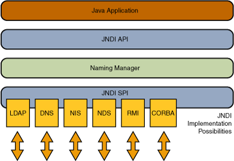

JNDI
========================================

简介
----------------------------------------
JNDI（Java Naming and Directory Interface，Java命名和目录接口）是为Java应用程序提供命名和目录访问服务的API，允许客户端通过名称发现和查找数据、对象，用于提供基于配置的动态调用。这些对象可以存储在不同的命名或目录服务中，例如RMI、CORBA、LDAP、DNS等。

其中Naming Service类似于哈希表的K/V对，通过名称去获取对应的服务。Directory Service是一种特殊的Naming Service，用类似目录的方式来存取服务。

|jndiarch|

JNDI注入
----------------------------------------
JNDI注入是2016年由pentester在BlackHat USA上的 ``A Journey From JNDI LDAP Manipulation To RCE`` 议题提出的。

其攻击过程如下

1. 攻击者将Payload绑定到攻击者的命名/目录服务中
2. 攻击者将绝对URL注入易受攻击的JNDI查找方法
3. 应用程序执行查找
4. 应用程序连接到攻击者控制的JNDI服务并返回Payload
5. 应用程序解码响应并触发有效负载

攻击载荷
----------------------------------------
JDNI主要有几种攻击载荷：

- CORBA
- IOR
- JNDI Reference
- JNDI Reference
- LDAP
- Remote Location
- Remote Object
- RMI
- Serialized Object

RMI Remote Object
~~~~~~~~~~~~~~~~~~~~~~~~~~~~~~~~~~~~~~~~
攻击者实现一个RMI恶意远程对象并绑定到RMI Registry上，将编译后的RMI远程对象类放在HTTP/FTP/SMB等服务器上。其中Codebase地址由远程服务器的 ``java.rmi.server.codebase`` 属性设置，供受害者的RMI客户端远程加载。

利用条件如下：

- RMI客户端的上下文环境允许访问远程Codebase。
- 属性 ``java.rmi.server.useCodebaseOnly`` 的值为false。

其中JDK 6u45、7u21后，``java.rmi.server.useCodebaseOnly`` 的值默认为true。

RMI + JNDI Reference
~~~~~~~~~~~~~~~~~~~~~~~~~~~~~~~~~~~~~~~~
攻击者通过RMI服务返回一个JNDI Naming Reference，受害者解码Reference时会去攻击者指定的远程地址加载Factory类。这种方式原理上并非使用RMI Class Loading机制，因此不受 ``java.rmi.server.useCodebaseOnly`` 系统属性的限制。但是在JDK 6u132, JDK 7u122, JDK 8u113 后限制了Naming/Directory服务中JNDI Reference远程加载Object Factory类的特性。系统属性 ``com.sun.jndi.rmi.object.trustURLCodebase`` 、 ``com.sun.jndi.cosnaming.object.trustURLCodebase`` 的默认值变为false，即默认不允许从远程的Codebase加载Reference工厂类。

LDAP + JNDI Reference
~~~~~~~~~~~~~~~~~~~~~~~~~~~~~~~~~~~~~~~~
LDAP服务的Reference远程加载Factory类不受 ``com.sun.jndi.rmi.object.trustURLCodebase`` 、``com.sun.jndi.cosnaming.object.trustURLCodebase`` 等属性的限制，适用范围更广。

