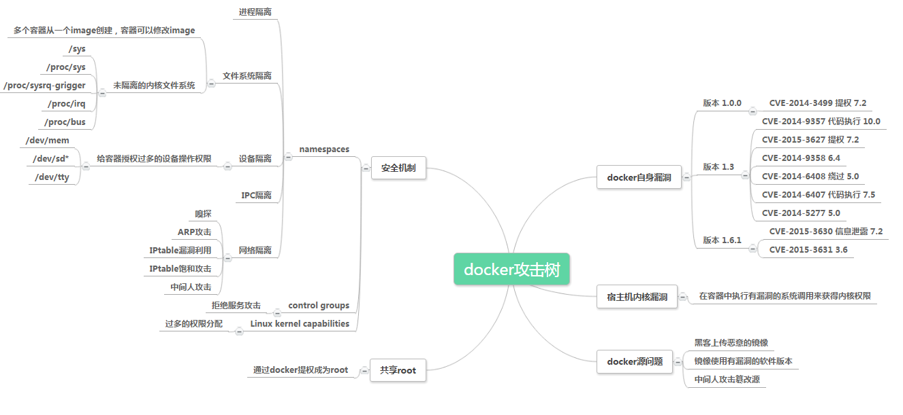

Docker
========================================

基础
----------------------------------------

传统虚拟化技术
~~~~~~~~~~~~~~~~~~~~~~~~~~~~~~~~~~~~~~~~
传统虚拟化技术通过添加hypervisor层，虚拟出网卡，内存，CPU等虚拟硬件，再在其上建立客户机，每个客户机都有自己的系统内核。传统虚拟化技术以虚拟机为管理单元，各虚拟机拥有独立的操作系统内核，不共用宿主机的软件系统资源，因此具有良好的隔离性，适用于云计算环境中的多租户场景。

容器技术
~~~~~~~~~~~~~~~~~~~~~~~~~~~~~~~~~~~~~~~~
容器技术可以看作一种轻量级的虚拟化方式，容器技术在操作系统层进行虚拟化，可在宿主机内核上运行多个虚拟化环境。相比于传统的应用测试与部署，容器的部署无需预先考虑应用的运行环境兼容性问题；相比于传统虚拟机，容器无需独立的操作系统内核就可在宿主机中运行，实现了更高的运行效率与资源利用率。

Docker
~~~~~~~~~~~~~~~~~~~~~~~~~~~~~~~~~~~~~~~~
Docker是目前最具代表性的容器平台之一，具有持续部署与测试、跨云平台支持等优点。在基于Kubernetes等容器编排工具实现的容器云环境中，通过对跨主机集群资源的调度，容器云可提供资源共享与隔离、容器编排与部署、应用支撑等功能。

安全风险
----------------------------------------
在考虑Docker安全性的时候主要考虑以下几点

- 内核本身的安全性及其对命名空间和cgroups的支持
- Docker守护进程本身的攻击面
- 内核的“强化”安全功能以及它们如何与容器进行交互

Docker安全基线
~~~~~~~~~~~~~~~~~~~~~~~~~~~~~~~~~~~~~~~~
|benchsec|

内核命名空间
~~~~~~~~~~~~~~~~~~~~~~~~~~~~~~~~~~~~~~~~
Docker容器与LXC容器非常相似，并且具有相似的安全特性。当使用docker运行启动容器时，Docker会在后台为容器创建一组命名空间和控制组。

命名空间提供了一个最直接的隔离形式：在容器中运行的进程看不到或者无法影响在另一个容器或主机系统中运行的进程。

每个容器也有自己的网络堆栈，这意味着一个容器不能获得对另一个容器的套接字或接口的特权访问。当然，如果主机系统相应设置，容器可以通过各自的网络接口交互。如果为容器指定公共端口或使用链接时，容器之间允许IP通信。

它们可以相互ping通，发送/接收UDP数据包，并建立TCP连接，但是如果需要可以限制它们。从网络体系结构的角度来看，给定Docker主机上的所有容器都位于网桥接口上。这意味着它们就像通过普通的以太网交换机连接的物理机器一样。

Control groups
~~~~~~~~~~~~~~~~~~~~~~~~~~~~~~~~~~~~~~~~
控制组是Linux容器的另一个关键组件。 他们实施资源核算和限制。 

它们提供了许多有用的度量标准，但也有助于确保每个容器都能获得公平的内存，CPU和磁盘I/O; 更重要的是单个容器不能耗尽这些资源中的一个来降低系统的性能。

因此，尽管它们不能阻止一个容器访问或影响另一个容器的数据和进程，但它们对于抵御一些拒绝服务攻击是至关重要的。 它们对于多租户平台尤其重要，例如公共和私人PaaS，即使在某些应用程序开始行为不当时也能保证一致的正常运行时间（和性能）。

守护进程的攻击面
~~~~~~~~~~~~~~~~~~~~~~~~~~~~~~~~~~~~~~~~
使用Docker运行容器意味着运行Docker守护进程，而这个守护进程当前需要root权限，因此，守护进程是需要考虑的一个地方。

首先，只有受信任的用户才能被允许控制Docker守护进程。具体来说，Docker允许您在Docker主机和访客容器之间共享一个目录;它允许你这样做而不限制容器的访问权限。这意味着可以启动一个容器，其中/host目录将成为主机上的/目录，容器将能够不受任何限制地改变主机文件系统。

这具有很强的安全意义：例如，如果通过Web服务器测试Docker以通过API配置容器，则应该更加​​仔细地进行参数检查，以确保恶意用户无法传递制作的参数，从而导致Docker创建任意容器。

守护进程也可能容易受到其他输入的影响，例如从具有docker负载的磁盘或从具有docker pull的网络加载映像。

最终，预计Docker守护进程将运行受限特权，将操作委托给审核良好的子进程，每个子进程都有自己的（非常有限的）Linux功能范围，虚拟网络设置，文件系统管理等。也就是说，很可能，Docker引擎本身的部分将在容器中运行。

Linux内核功能
~~~~~~~~~~~~~~~~~~~~~~~~~~~~~~~~~~~~~~~~
默认情况下，Docker使用一组受限的功能启动容器。

功能将“root/non-root”二分法转变为一个细粒度的访问控制系统。只需要绑定在1024以下端口上的进程（如web服务器）不必以root身份运行：它们可以被赋予net_bind_service功能。

在大多数情况下，容器不需要“真正的”root权限。因此，Docker可以运行一个能力较低的集合;这意味着容器中的“root”比真正的“root”要少得多。例如：

- 否认所有挂载操作
- 拒绝访问原始套接字（防止数据包欺骗）
- 拒绝访问某些文件系统操作，如创建新的设备节点，更改文件的所有者或修改属性（包括不可变标志）
- 拒绝模块加载
- 其他

这意味着，即使入侵者在容器内获取root权限，进一步攻击也会困难很多。

默认情况下，Docker使用白名单而不是黑名单，去除了所有非必要的功能。

攻击面分析
----------------------------------------

供应链安全
~~~~~~~~~~~~~~~~~~~~~~~~~~~~~~~~~~~~~~~~
在构建Dockerfile的过程中，即使是使用排名靠前的来源，也可能存在CVE漏洞、后门、镜像污染等问题。

虚拟化风险
~~~~~~~~~~~~~~~~~~~~~~~~~~~~~~~~~~~~~~~~
虽然Docker通过命名空间进行了文件系统资源的基本隔离，但仍有 ``/sys`` 、``/proc/sys`` 、 ``/proc/bus`` 、 ``/dev`` 、``time`` 、``syslog`` 等重要系统文件目录和命名空间信息未实现隔离，而是与宿主机共享相关资源。

利用内核漏洞逃逸
~~~~~~~~~~~~~~~~~~~~~~~~~~~~~~~~~~~~~~~~
- CVE-2016-5195

容器逃逸漏洞
~~~~~~~~~~~~~~~~~~~~~~~~~~~~~~~~~~~~~~~~
- CVE-2019-5736
- CVE-2018-18955

拒绝服务
~~~~~~~~~~~~~~~~~~~~~~~~~~~~~~~~~~~~~~~~
- CPU耗尽
- 内存耗尽
- 存储耗尽
- 网络资源耗尽

危险挂载
~~~~~~~~~~~~~~~~~~~~~~~~~~~~~~~~~~~~~~~~
- 挂载 ``/var/run/docker.sock``
- 挂载宿主机procfs

安全加固
----------------------------------------
- 移除依赖构建
- 配置严格的网络访问控制策略
- 不使用root用户启动docker
- 不以privileged特权模式运行容器
- 控制资源
    - CPU Share
    - CPU 核数
    - 内存资源
    - IO 资源
- 使用安全的基础镜像
- 定期安全扫描和更新补丁
- 删除镜像中的setuid和setgid权限
    - ``RUN find / -perm +6000-type f-exec chmod a-s {} \;|| true``
- 配置Docker守护程序的TLS身份验证

存在特征
----------------------------------------

Docker内
~~~~~~~~~~~~~~~~~~~~~~~~~~~~~~~~~~~~~~~~
- MAC地址为 ``02:42:ac:11:00:00`` - ``02:42:ac:11:ff:ff``
- ``ps aux`` 大部分运行的程序 pid 都很小
- ``cat /proc/1/cgroup`` docker的进程

Docker外
~~~~~~~~~~~~~~~~~~~~~~~~~~~~~~~~~~~~~~~~
- ``/var/run/docker.sock`` 文件存在
- ``2375`` / ``2376`` 端口开启

参考链接
----------------------------------------
- `A House of Cards An Exploration of Security When Building Docker Containers <https://blog.heroku.com/exploration-of-security-when-building-docker-containers>`_
- `Privileged Docker Containers <http://obrown.io/2016/02/15/privileged-containers.html>`_
- `32c3 docker writeup <https://kitctf.de/writeups/32c3ctf/docker>`_
- `打造安全的容器云平台 <https://blog.qiniu.com/archives/7743>`_
- `Docker security <https://docs.docker.com/engine/security/security/>`_
- `容器安全 <http://blog.nsfocus.net/docker-mirror-security/>`_
- `CVE-2017-7494 Docker沙箱逃逸 <https://strm.sh/post/abusing-insecure-docker-deployments/>`_
- `Docker容器安全性分析 <https://www.freebuf.com/articles/system/221319.html>`_

