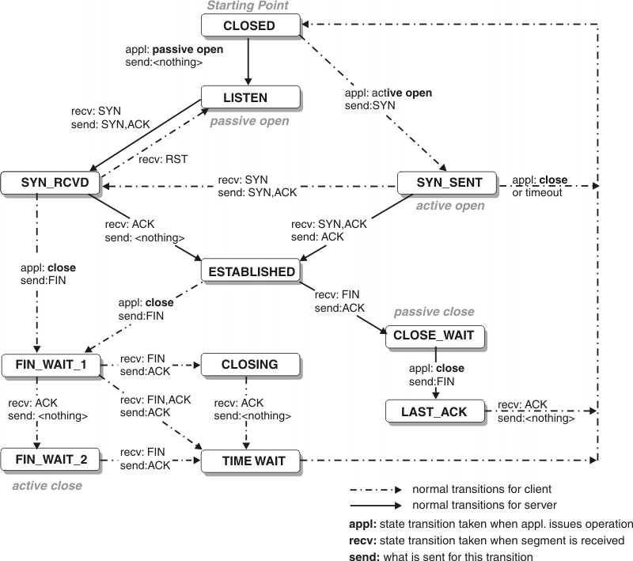

TCP协议
========================================

简介
----------------------------------------
TCP（Transmission Control Protocol，传输控制协议）是一种面向连接的、可靠的、基于字节流的传输层通信协议，由RFC 793定义。

TCP状态
----------------------------------------
|statetransition|

三次握手
~~~~~~~~~~~~~~~~~~~~~~~~~~~~~~~~~~~~~~~~
三次握手（Three-Way Handshake）是指建立一个TCP连接时，需要客户端和服务端总共发送3个包以确认连接的建立。

第一次握手客户端将标志位 SYN 置为1，随机产生一个值 seq=s ，并将该数据包发送给服务端，客户端进入 SYN_SENT 状态，等待服务端确认。

第二次握手服务端收到数据包后由标志位 SYN=1 知道客户端请求建立连接，服务端将标志位 SYN 和 ACK 都置为1，ack=s+1，随机产生一个值 seq=k ，并将该数据包发送给客户端以确认连接请求，服务端进入 SYN_RCVD 状态。

第三次握手客户端收到确认后，检查ack值是否为s+1，ACK标志位是否为1，如果正确则将标志位 ACK 置为1，ack=k+1，并将该数据包发送给服务端，服务端检查ack值是否为k+1，ACK标志位是否为1，如果正确则连接建立成功，客户端和服务端进入 ESTABLISHED 状态，完成三次握手。

四次挥手
~~~~~~~~~~~~~~~~~~~~~~~~~~~~~~~~~~~~~~~~
四次挥手（Four-Way Wavehand）指断开一个TCP连接时，需要客户端和服务端总共发送4个包以确认连接的断开。

第一次挥手客户端发送一个 FIN ，用来关闭客户端到服务端的数据传送，客户端进入 FIN_WAIT_1 状态。

第二次挥手服务端收到 FIN 后，发送一个 ACK 给客户端，确认序号为收到序号+1，服务端进入 CLOSE_WAIT 状态。

第三次挥手服务端发送一个 FIN ，用来关闭服务端到客户端的数据传送，服务端进入 LAST_ACK 状态。

第四次挥手客户端收到 FIN 后，客户端进入 TIME_WAIT 状态，接着发送一个 ACK 给服务端，确认序号为收到序号+1，服务端进入 CLOSED 状态，完成四次挥手。

拥塞控制
----------------------------------------
拥塞是指网络中报文数量过多，使得服务端来不及处理，以致引起这部分乃至整个网络性能下降的现象，严重时甚至会导致网络通信业务陷入停顿即出现死锁现象。

TCP采用拥塞控制算法来减少或者避免拥塞现象的发生，TCP的拥塞算法有过多种实现，包括Tahoe、Reno、NewReno、Vegas、Hybla、BIC 、CUBIC、SACK、Westwood、PRR、BBR等。

参考链接
----------------------------------------
- `RFC 793 TRANSMISSION CONTROL PROTOCOL <https://tools.ietf.org/html/rfc793>`_
- `RFC 2001 TCP Slow Start, Congestion Avoidance, Fast Retransmit, and Fast Recovery Algorithms <https://tools.ietf.org/html/rfc2001>`_
- `RFC 3390 Increasing TCP's Initial Window <https://tools.ietf.org/html/rfc3390>`_
- `RFC 5681 TCP Congestion Control <https://tools.ietf.org/html/rfc5681>`_
- `TCP congestion control wiki <https://en.wikipedia.org/wiki/TCP_congestion_control>`_

